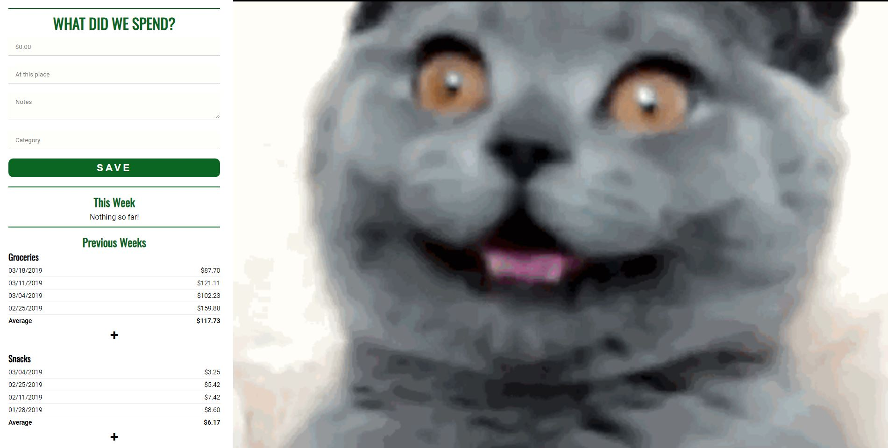

# the-food-budget

This is a simple spending-tracker app to help understand how much you're spending on various things per week. I initially wrote this when I first learned PHP. It was for my wife and I to track our food spending (groceries, snacks, restaurants) and it's pretty focused on groceries, but I'm sure you can make it work for anything you like.

I recently learned Vue.js and decided recoding this old app would be a good opportunity to take Vue for a test-drive.

